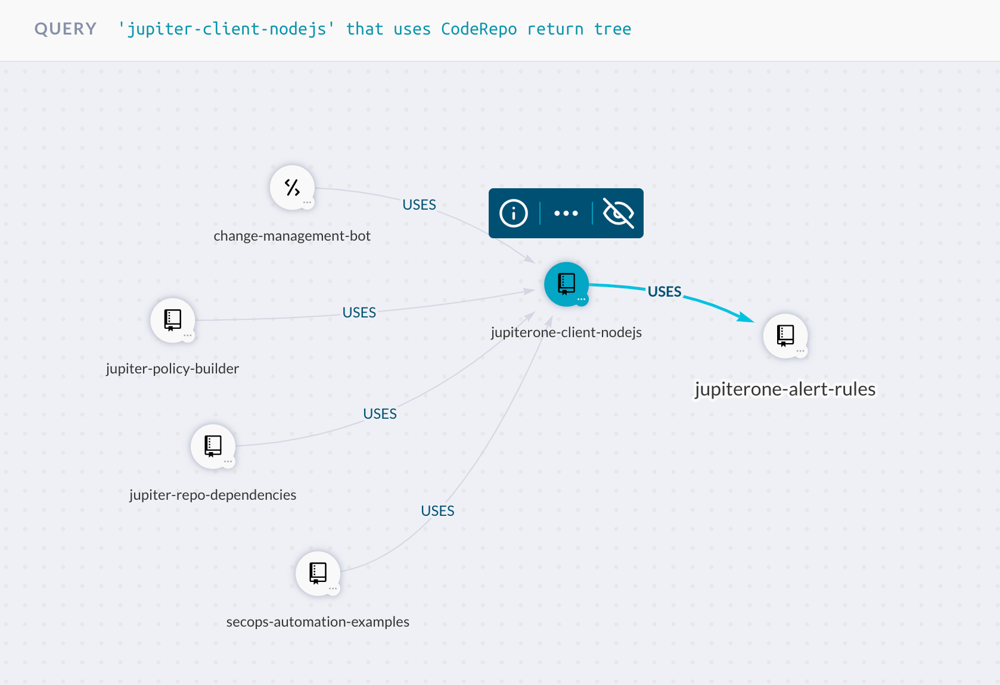

# JupiterOne Repository Relationship Generator

A script that generates JupiterOne entity relationships between a repository and
its dependencies. This script will look for dependencies within a repository's
`package.json` file as well as the `dependencies.yaml` file if the repository has
a `deploy` directory.

This script currently works with node.js dependencies in package.json only.
Additionally, this script only creates relationships for `dependencies` (not
`devDependencies`).

## Before Running

- Create a directory containing the repositories that you would like the script
  to be run against (Note: You will need the path to this directory while running the
  script).

- Ensure that the `package.json` for each repository is at the root of the
  repository.

- JupiterOne API credentials are required to run the necessary queries to create
  the relationships.

  - You must pass in your account and access token.
  - You will be prompted for both of these when you run the script.
  - You have the option to create env variables to bypass manually entering them
    into the console.

    - Use `J1_ACCOUNT` for the account variable and `J1_API_TOKEN` for the
      access token variable.

## Running the script

- Use `yarn start`

- If you wish to only run the script on a certain group of dependencies, you
  have the option of inputting any number of package scopes.

  For Example:

  - Dependencies list:

    - `@jupiterone/jupiterone-client-nodejs`
    - `@lifeomic/alpha`
    - `@lifeomic/base-pipeline`
    - `graphlql`
    - `dotenv`

    ```bash
    Input a package scope, i.e. @package (input DONE when finished): @lifeomic
    Input a package scope, i.e. @package (input DONE when finished): @jupiterone
    Input a package scope, i.e. @package (input DONE when finished): DONE
    ```

    This set of inputs will create relationships for the first three items on
    the dependencies list above.

- Example Output:

  ```bash
  Could not query Repo (advent-helix-vcf-ingest).
  Could not query Repo (app-store-admin-web).
  Could not query Repo (app-store-service).
  
  Repo: scheduler
  Successfully created relationship (scheduler USES @lifeomic/alpha: ^0.14.0).
  Failed to create relationship with @lifeomic/attempt: ^3.0.0 (was not found on the graph). Skipped.
  Successfully created relationship (scheduler USES @lifeomic/koa: ^7.1.1).
  Successfully created relationship (scheduler USES @lifeomic/lambda-runtime-tools: ^3.4.1).
  Successfully created relationship (scheduler USES @lifeomic/logging: ^1.0.5).
  Successfully created relationship (scheduler USES lambda-cloudwatch-slack, deploy).
  Successfully created relationship (scheduler USES provision-environment, deploy).
  Successfully created relationship (scheduler USES provision-pager-duty, deploy).
  Successfully created relationship (scheduler USES sumo-cloudwatch-logs, deploy).
  
  Repo: koa
  *** Repo does not have a deploy directory with a dependencies.yaml ***
  Successfully created relationship (koa USES @lifeomic/abac: ^2.0.3).
  Successfully created relationship (koa USES @lifeomic/alpha: ^0.12.1).
  Successfully created relationship (koa USES @lifeomic/fhir-schemas: ^2.1.1).
  Successfully created relationship (koa USES @lifeomic/platform-headers: ^1.3.0).
  Successfully created relationship (koa USES @lifeomic/usage-stream: ^6.0.0).
  
  Summary:
  Created Relationships: 13
  Failed Attempts: 1
  Failed dependencies:
    @lifeomic/attempt: ^3.0.0 (scheduler).
  ```

## Querying the visualizing the graph in JupiterOne

You can then run queries in JupiterOne to generate reports and visualizations
of your repo dependencies. For example:

**Which internal repo is mostly used by other repos?**

```j1ql
Find CodeRepo as repo
  that uses CodeRepo as dependency
return
  dependency.name, count(repo) as dependents
order by dependents desc
```

**Show a visual dependency graph of a particular repo:**

```j1ql
'jupiter-client-nodejs' that uses CodeRepo return tree
```

> Replace `jupiter-integration-okta` in the above query with the desired repo
> name.



## Current limitations

- This script only parses repos pulled down locally and does not handle remote
  repos.

- This script is limited to analyzing the `package.json` file for `node.js`
  projects.

- This script only creates relationships for `dependencies` (not
  `devDependencies`).

- This script does not currently handle deletion of repo dependency
  relationships if the dependency is removed from the `package.json` file.
